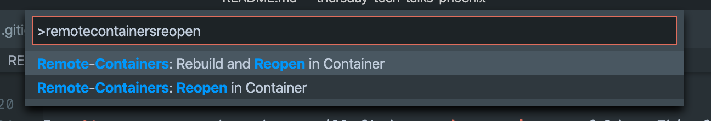
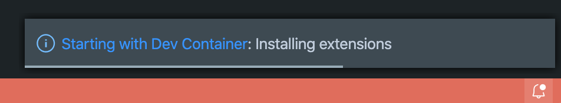
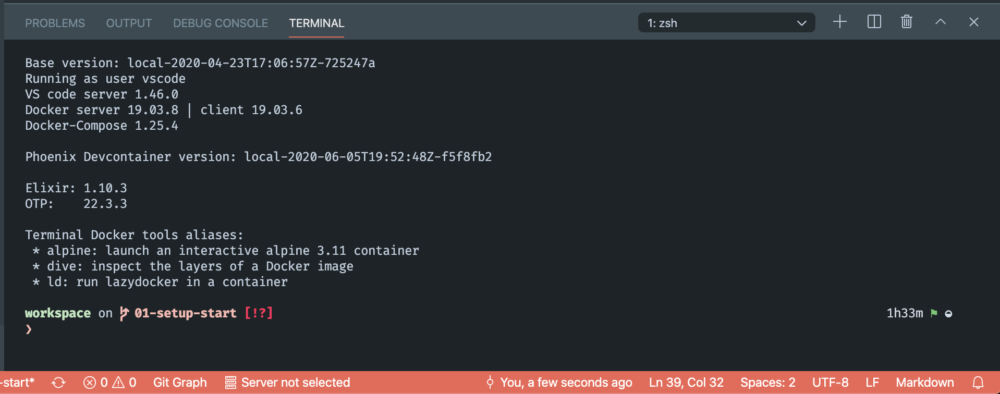

# Tech Thursday - Build a Phoenix app with LiveView (2020-06-18)

We will be building a simple TODO list web app with server side rendering using [phoenix framework](https://www.phoenixframework.org/).

We will use Visual Studio Code with the remote containers extension so we can develop using docker without the need to install elixir or any other related tools in our host machine.

## Requirements

* __Visual Studio Code__ with the [Remote - Containers](https://marketplace.visualstudio.com/items?itemName=ms-vscode-remote.remote-containers) extension installed
* __git__ as the repository in [Github](https://github.com/pap/thursday-tech-talks-phoenix) will have branches for each of the steps so you can follow along more conveniently
* __docker__
* __docker_compose__

## 01 Setup Devcontainer

The result of this step will be available in the [_01-setup_ branch](https://github.com/pap/thursday-tech-talks-phoenix/tree/01-setup-devcontainer)

We will start by importing the needed files to setup the development environment using Remote Containers and bootstrap the phoenix application.

In _01-setup-devcontainer_ branch you will find a __.devcontainers__ folder. This folder contains the following files:

* .devcontainer.json
* docker-compose.yml
* tasks.json

With this folder in place and the remote extensions we can start development in a remote container. To do so press CMD + SHIFT + P and in the dropdown write `remote containers` selecting the `Remote-Containers: Reopen in Container`

This will take some time and you should see a popup informing of the progress

Clicking on the popup will get you to more detailed logs if you wish to see what is going on under the hood.

When the process finishes a terminal window should appear. Remember you are no longer developing in the host machine. You are now developing inside a container with a volume mounting the code you have on the host machine.

Your code will be available in `/workspace` and your home folder, the one for the _vscode_ user, is located at `/home/vscode`.

>The current setup, via docker-compose, allows you to share ssh keys so you can push to your git remotes from the container. This setup also allows you to use docker as if you were on the host machine. Any docker image you create inside the remote container will be visible on the host and vice-versa.

We are now ready to bootstrap our phoenix application!
