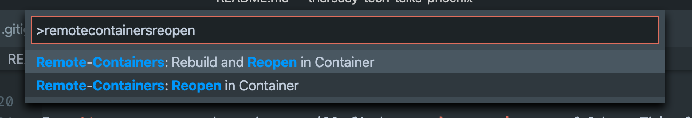
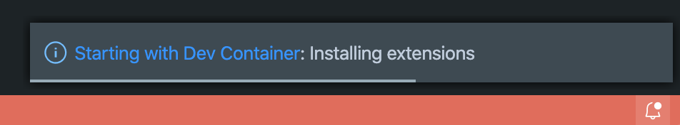
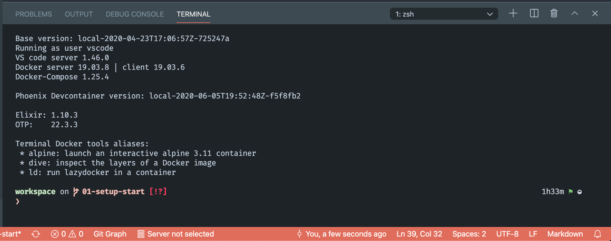
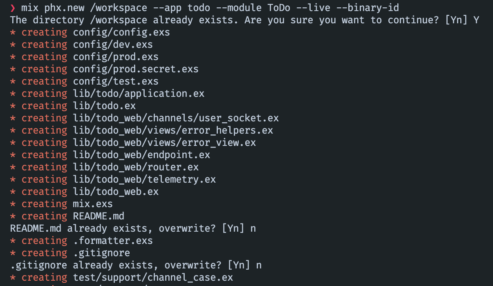
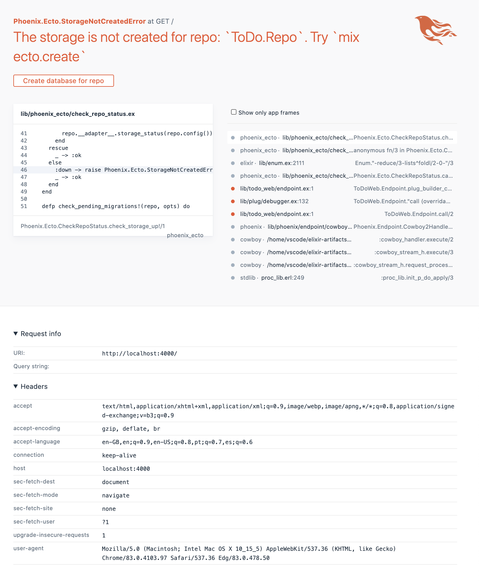

# Tech Thursday - Build a Phoenix app with LiveView (2020-06-18)

We will be building a simple TODO list web app with server side rendering using [phoenix framework](https://www.phoenixframework.org/).

We will use Visual Studio Code with the remote containers extension so we can develop using docker without the need to install elixir or any other related tools in our host machine.

## Requirements

* __Visual Studio Code__ with the [Remote - Containers](https://marketplace.visualstudio.com/items?itemName=ms-vscode-remote.remote-containers) extension installed
* __git__ as the repository in [Github](https://github.com/pap/thursday-tech-talks-phoenix) will have branches for each of the steps so you can follow along more conveniently
* __docker__
* __docker_compose__

## 01 Setup Devcontainer

The result of this step will be available in the [_01-setup_ branch](https://github.com/pap/thursday-tech-talks-phoenix/tree/01-setup-devcontainer)

We will start by importing the needed files to setup the development environment using Remote Containers and bootstrap the phoenix application.

In _01-setup-devcontainer_ branch you will find a __.devcontainers__ folder. This folder contains the following files:

* .devcontainer.json
* docker-compose.yml
* tasks.json

Later on we will be using a custom docker network to connect to a postgres container. For that reason and to prevent failure in opening the workspace in remote containers create the network by entering the following command:

```sh
docker network create infra_network
```

Now with the custom network created, the _.devcontainers_ folder in place and the remote container extension installed we can start development in a remote container. To do so press CMD + SHIFT + P and in the dropdown write `remote containers` selecting the `Remote-Containers: Reopen in Container`



This will take some time and you should see a popup informing of the progress



Clicking on the popup will get you to more detailed logs if you wish to see what is going on under the hood.

When the process finishes a terminal window should appear. Remember you are no longer developing in the host machine. You are now developing inside a container with a volume mounting the code you have on the host machine.



Your code will be available in `/workspace` and your home folder, the one for the _vscode_ user, is located at `/home/vscode`.

>The current setup, via docker-compose, allows you to share ssh keys so you can push to your git remotes from the container. This setup also allows you to use docker as if you were on the host machine. Any docker image you create inside the remote container will be visible on the host and vice-versa.

We are now ready to bootstrap our phoenix application!

## 02 Bootstrap the application

To generate the phoenix app we will issue the following command:

```sh
mix phx.new /workspace --app todo --module ToDo --live --binary-id
```

Given we are creating the app in an already existing directory with some files already in there you will be asked a few questions. The screenshot below shows the options you have to select for each question:



The app will be created and you will be asked if you want to install dependencies. Answer `N` as we have a small trick on our sleeves to make sure we are not affected by synchronization issues in Docker for Mac.

We can discuss this in further detail but the short version is that in order to make sure we don't get any slowdowns synchronizing the dependencies and build directories with the host machine we have created a volume, `elixir-artifacts` that will be mounted on the vscode user home dir in the container so that we do not need to keep track of those in our host machine. This also prevents any issues that may arise from mixing builds for different target systems - Linux, Mac etc.

### Change the default location for dependencies and builds

We have set a few environemnt variables via the compose file. The ones that matter for this customization of build and dependencies location are:

* __ELIXIR_BUILD_PATH__=/home/vscode/elixir-artifacts/_build
* __ELIXIR_DEPS_PATH__=/home/vscode/elixir-artifacts/deps

In order to setup new locations all we need to do is to open the _mix.exs_ file and add the following lines to the `project` function:

```sh
build_path: System.get_env("ELIXIR_BUILD_PATH") || "./_build",
deps_path: System.get_env("ELIXIR_DEPS_PATH") || "./deps",
```

The function should look like this:

```sh
def project do
    [
      app: :todo,
      version: "0.1.0",
      elixir: "~> 1.7",
      build_path: System.get_env("ELIXIR_BUILD_PATH") || "./_build",
      deps_path: System.get_env("ELIXIR_DEPS_PATH") || "./deps",
      elixirc_paths: elixirc_paths(Mix.env()),
      compilers: [:phoenix, :gettext] ++ Mix.compilers(),
      start_permanent: Mix.env() == :prod,
      aliases: aliases(),
      deps: deps()
    ]
  end
```

Now we are ready to fetch the elixir and node dependencies.

In the terminal run `mix deps.get` to fetch the elixir dependencies and then `npm install --prefix assets` to finish the assets setup.

### Setup the connection to the DB

Given we are using docker it seems suitable that we use a container to run Postgres. I tend to reuse some of these infra containers to allow sharring them between multiple projects. This way I don't need to have one DB container per application.

Create a separate docker-compose file to start the DB instance in a different location __on your host machine__.

```sh
version: "3.8"

services:
  postgres:
    container_name: "${POSTGRES_DOCKER_NAME-postgres}"
    environment:
      POSTGRES_DB: postgres
      POSTGRES_USER: postgres
      POSTGRES_PASSWORD: postgres
      PSQL_TRUST_LOCALNET: 'true'
      ENCODING: UTF8
    image: postgres:9.6
    healthcheck:
      test: ["CMD", "pg_isready", "-d", "postgres", "-U", "postgres"]
      interval: 10s
      timeout: 3s
      retries: 10
    ports:
      - 5432:5432
    volumes:
      - /Users/paulo/docker/volumes/postgres:/var/lib/postgresql/data
    networks:
      - default
      - infra

networks:
    infra:
      external:
        name: infra_network
```

The following line allows persisting data even between container recreation:

```sh
volumes:
  - /Users/paulo/docker/volumes/postgres:/var/lib/postgresql/data
```

Please make sure you create a folder in your host machine and change the line above accordingly. Or remove it if you don't want to persist Postgres data between container restarts.

To start the DB container run `docker-compose up` in the directory where you created the compose file.

> You can add postgres to the _docker-compose.yml_  file in the _.devcontainers_ folder too

### Start the phoenix app

Before we boot the application we need to fix the settings to connect to the database as we are not running the app locally. The DB_HOST is not `localhost` as it is predefined in the configuration that was autogenerated. Open the `config/dev.exs` file and change line number 8 with the following:

```sh
  hostname: "postgres",
```

To boot the application run the following command:

```sh
mix phx.server
```

On the first run dependencies will be compiled so it will take a bit longer. Afterwards you will have incremental compilation and only what will change will be recompiled. In development mode changes made to most elixir source files as well as to css, html, and js files are also recompiled and the application will reload.

Once the application starts you will see a lot of errors like thos one:

`[error] Postgrex.Protocol (#PID<0.351.0>) failed to connect: ** (Postgrex.Error) FATAL 3D000 (invalid_catalog_name) database "todo_dev" does not exist`

It is expected! I could have told you to run `mix setup` before booting and the DB would have been created but let's do it using the app itself. It is a good chance to show you the level of care for developer experience that the phoenix team and the elixir community have.

Open a browser window and access the running app at `http://localhost:4000`
you will se an error page, a very interesting one:



You will fnd the stacktrace the line of code where the error happened, info about the request and headers and in this particular case a button that you may click to create the missing database and solve the error.


Click the button and the db will be created, the error will be fixed and the app will resume execution displaying the initial page.

> Like with a missing DB whenever there are database migrations that were not executed yet an error page will display giving you the option to run missing migrations with the click of a button.
